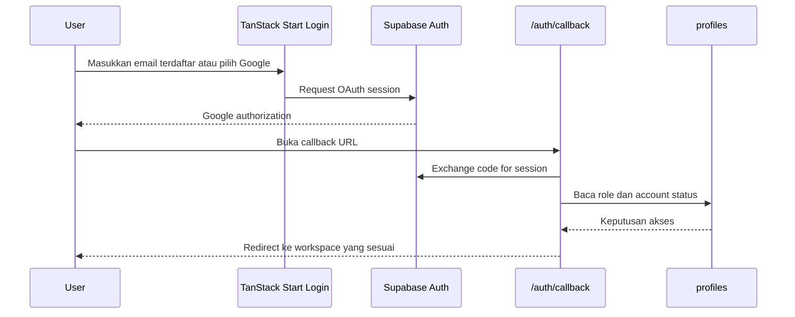
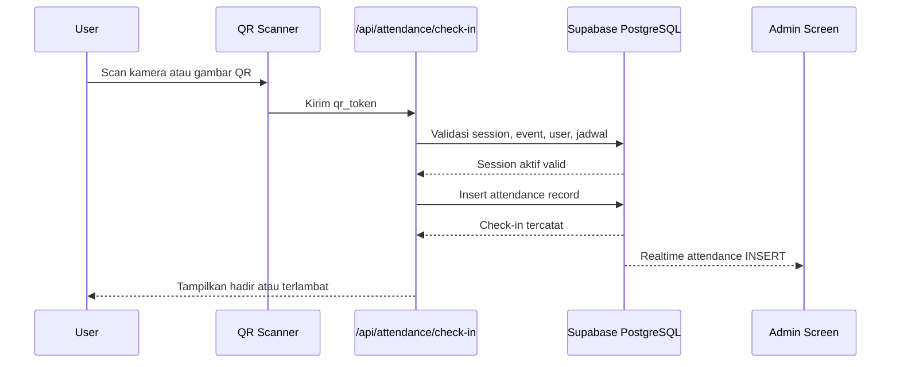
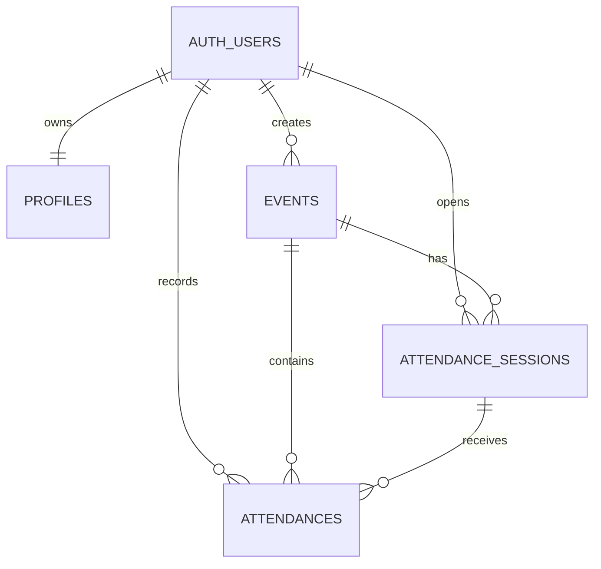

# Absendulu — Product Requirements Document (PRD)

**Product:** Absendulu  
**Organization:** FILKOM UNIDA  
**Version:** v0.1.1  
**Capacity:** ±50 internal users  
**Status:** Production-ready  

---

## 1. Product Overview

Absendulu adalah platform digital absensi event internal untuk organisasi FILKOM UNIDA. Aplikasi ini menggantikan daftar hadir manual dengan alur kerja terkontrol yang dibangun di atas Supabase Auth, provisioning member berbasis undangan, manajemen event, QR check-in, counter kehadiran realtime, dan role-based access control.

### 1.1 Tujuan Produk

- Memudahkan panitia event dalam mendata kehadiran anggota secara realtime.
- Menghilangkan paper trail dan kesalahan pencatatan manual.
- Menjamin hanya anggota terdaftar yang dapat melakukan check-in.
- Memberikan rekapitulasi kehadiran yang akurat dan terverifikasi.

### 1.2 Ruang Lingkup

- Aplikasi web berbasis browser (tanpa native mobile app).
- Manajemen member dan event oleh panitia (admin).
- Check-in anggota melalui pemindaian QR code via kamera atau upload gambar.
- Rekapitulasi kehadiran untuk admin dan history pribadi untuk anggota.

### 1.3 Out of Scope (v0.1.x)

- Self-signup publik (akses invite-only).
- Multi-organization atau white-label.
- Native mobile application.
- Payment atau ticketing.
- Integrasi kalender eksternal (Google Calendar, Outlook).

---

## 2. User Roles & Permissions

### 2.1 Admin / Panitia

Role yang diakui sebagai administrator:

- `admin`
- `admin_bem`

Hak akses admin:

| Fitur | Akses |
|-------|-------|
| Dashboard operasional | Ya |
| Manajemen member (CRUD) | Ya |
| Import CSV member (maks 500 baris) | Ya |
| Membuat dan menghapus event | Ya |
| Membuka dan menutup sesi QR | Ya |
| Melihat semua record absensi | Ya |
| Monitoring live check-in count | Ya |
| Mengedit field `division` pada profile | Ya |

### 2.2 Anggota / Mahasiswa

Role default untuk anggota aktif non-admin: `user`

Hak akses anggota:

| Fitur | Akses |
|-------|-------|
| Melihat event aktif | Ya |
| Melihat detail event | Ya |
| Memindai QR code | Ya |
| Check-in satu kali per event | Ya |
| Mengedit field `full_name` dan `nim` | Ya |
| Melihat riwayat absensi sendiri | Ya |

Batasan anggota:

- Tidak dapat mengelola member lain.
- Tidak dapat membuat atau menghapus event.
- Tidak dapat mengakses internal sesi QR.
- Tidak dapat melihat absensi anggota lain.
- Tidak dapat mengubah role atau account status sendiri.

### 2.3 Teknis Operator

Role non-di-UI yang bertugas memelihara deployment dan database:

- Menjamin environment variables production terkonfigurasi.
- Menerapkan reviewed database migrations.
- Memantau `/api/health` dan deployment logs.
- Memelihara Supabase Auth providers dan redirect URLs.
- Menjaga backup dan akses ke production project.

---

## 3. User Types

Selain role, sistem mengenali jenis anggota berikut melalui field `user_type`:

| Tipe | Keterangan |
|------|------------|
| `mahasiswa` | Anggota mahasiswa. Identifier (NIM) harus sesuai format `I.#######` |
| `dosen` | Anggota dosen. Identifier (NIP/NIK) harus valid |
| `tata_usaha` | Anggota tata usaha. Identifier (NIP/NIK) harus valid |

Identifier default untuk akun tanpa NIM/NIP terverifikasi: `AUTH-<uuid>`.

---

## 4. Account Status & Onboarding Flow

Field `account_status` mengontrol akses anggota:

| Status | Makna | Aksi Wajib |
|--------|-------|------------|
| `invited` + profile tidak lengkap | Data identitas belum diisi | Redirect ke `/complete-profile` |
| `invited` + profile lengkap | Menunggu aktivasi panitia | Tidak ada redirect otomatis ke `/waiting-approval`; route `/waiting-approval` dapat diakses manual |
| `active` | Akun disetujui dan aktif | Akses dashboard atau workspace mahasiswa |
| `disabled` / `is_active = false` | Akses diblokir | Redirect ke `/account-disabled` |

### 4.1 Alur Onboarding (Self via Google OAuth)

Anggota baru yang login via Google:

1. Jika belum ada `profiles` → auto-create dengan NIM generated `AUTH-<uuid>`, `account_status: invited`, `role: user`, `is_active: true`.
2. Redirect ke `/complete-profile` untuk mengisi NIM/NIP dan full name.
3. Setelah disubmit dan valid, `account_status` berubah menjadi `active`.
4. Akun dengan email `I.########@unida.ac.id` (campus email) melewati onboarding dan langsung ke workspace mahasiswa.

### 4.2 Alur Pembuatan Member oleh Admin

Panitia membuat member via form manual atau import CSV:

1. Admin memasukkan data member.
2. Sistem membuatkan Supabase Auth user jika belum ada.
3. Sistem membuat/update `public.profiles`.
4. `account_status` diset menjadi `active`.
5. Member dapat langsung login menggunakan email yang terdaftar.

---

## 5. Feature Requirements

### 5.1 Autentikasi & Otorisasi

- **Invite-only access:** Tidak ada public signup dari halaman login (`shouldCreateUser: false`).
- **Google OAuth:** Satu-satunya metode login yang tersedia di UI (`signInWithOAuth({ provider: 'google' })`).
- **Session management:** Server-side auth snapshot di-cache selama 10 detik.
- **Route guards:** Semua route under `/_auth` dilindungi oleh `beforeLoad` yang memvalidasi session, account status, dan active flag.
- **Generic error messaging:** Pesan login error tidak mengunggung informasi email enumeration.

### 5.2 Manajemen Member

**Admin dapat:**

- Mendaftarkan member baru secara manual.
- Mengimpor daftar member via CSV (maks 500 baris, 2 MB data CSV, 3 MB total multipart form).
- Mencari dan memfilter daftar member.
- Mengaktifkan / menonaktifkan akun member.
- Melihat detail member (nama, NIM/NIP, email, tipe user, divisi, role, status).

**Aturan validasi member:**

- NIM mahasiswa: format `I.#######`.
- NIP/NIK dosen/tata_usaha: format alfanumerik valid.
- Email harus unik.
- NIM/NIP harus unik.
- Duplikat email atau identifier dalam satu file CSV ditolak.

### 5.3 Manajemen Event

**Admin dapat:**

- Membuat event baru (nama, deskripsi, tanggal, waktu mulai, waktu selesai, lokasi).
- Mengubah status event.
- Menghapus event secara permanen.

**Lifecycle event:**

```
draft → active → completed
              ↘ cancelled
```

**Aturan event:**

- Hanya event dengan status `active` yang dapat membuka sesi QR.
- Event yang sudah dihapus tidak dapat dipulihkan.
- Penghapusan event menghapus juga data sesi dan absensi terkait.

### 5.4 Sistem QR Attendance

**Fitur QR:**

- Satu sesi QR terbuka per event (diperkenalkan oleh unique partial index).
- Token QR dihasilkan secara kriptografis (24 byte base64url).
- QR code dapat ditampilkan dalam mode fullscreen dan didownload sebagai gambar.
- Pindaian QR via kamera (menggunakan `html5-qrcode`) atau upload gambar.
- Satu anggota hanya dapat check-in satu kali per event.

**Aturan check-in:**

Check-in diterima hanya jika:

1. User session valid dan terautentikasi.
2. Profile anggota aktif (`account_status: active`, `is_active: true`).
3. QR token valid dan berada di sesi yang masih terbuka (`is_open: true`).
4. Event aktif (`status: active`).
5. Waktu check-in berada dalam rentang jadwal event.
6. Anggota belum pernah check-in ke event tersebut.

**Status kehadiran:**

| Status | Kondisi |
|--------|---------|
| `hadir` | Check-in berada dalam rentang jadwal event (setelah waktu mulai sampai sebelum waktu selesai) |
| `terlambat` | Check-in dilakukan setelah waktu selesai event |
| `izin` | Diatur oleh panitia (tidak melalui QR scan) |
| `alpha` | Tidak hadir (tidak melalui check-in) |

Method absensi:

- `QR_CODE` — melalui pemindaian QR.
- `MANUAL` — input oleh panitia.

> **Catatan:** Tidak ada threshold 15 menit dalam implementasi saat ini. Status `terlambat` hanya ditetapkan ketika check-in dilakukan setelah `end_time` event. Check-in setelah `start_time` tapi sebelum `end_time` tetap dihitung sebagai `hadir`.

### 5.5 Realtime & Monitoring

- Counter kehadiran live untuk admin via Supabase Realtime.
- Admin dapat melihat peserta terbaru selama sesi QR terbuka.
- Tabel `attendances` didaftarkan dalam Supabase Realtime publication.

### 5.6 Riwayat Absensi

**Mahasiswa:**

- Melihat riwayat absensi sendiri (event, waktu check-in, method, status).

**Admin:**

- Melihat rekapitulasi absensi per event (nama peserta, NIM/NIP, status, method, waktu check-in).
- Dapat melihat daftar peserta terbaru selama sesi terbuka.

### 5.7 Profile Management

**Anggota dapat mengedit:**

- `full_name`
- `nim` (jika bukan identifier generated `AUTH-`)

**Admin dapat mengedit:**

- Semua field di atas.
- `division`

**Perilaku auto-activation:**

- Jika anggota dengan `account_status: invited` berhasil memperbarui profile, akun otomatis diaktifkan (`account_status: active`).

---

## 6. Business Flow (End-to-End)

### 6.1 Flow Utama Operasi Event

```
1. Panitia mendaftarkan member (manual / CSV)
   ↓
2. Member login (Google OAuth)
   ↓
3. Onboarding / Complete Profile (jika diperlukan)
   ↓
4. Akun aktif → anggota masuk workspace
   ↓
5. Panitia membuat event dan set status = active
   ↓
6. Panitia membuka sesi QR attendance
   ↓
7. Anggota memindai QR code
   ↓
8. Sistem validasi check-in
   ↓
9. Absensi tercatat + counter live terupdate
   ↓
10. Panitia menutup sesi
   ↓
11. Rekapitulasi absensi ditinjau oleh panitia
```

### 6.2 Detail Login Flow



### 6.3 Detail Check-in Flow



---

## 7. Database Schema

### 7.1 Entity Relationship



### 7.2 Tables

**profiles**

| Field | Tipe | Keterangan |
|-------|------|------------|
| `id` | UUID PK | Referensi ke `auth.users(id)` |
| `full_name` | TEXT NOT NULL | Nama lengkap |
| `nim` | TEXT UNIQUE NOT NULL | NIM/NIP/NIK |
| `nim_format_legacy` | BOOLEAN DEFAULT false | Flag legacy NIM format |
| `email` | TEXT | Email anggota |
| `division` | TEXT | Divisi (opsional) |
| `phone` | TEXT | Nomor telepon (opsional) |
| `user_type` | TEXT DEFAULT `mahasiswa` | `mahasiswa`, `dosen`, `tata_usaha` |
| `account_status` | TEXT DEFAULT `invited` | `invited`, `active`, `disabled` |
| `is_active` | BOOLEAN DEFAULT true | Flag aktif/nonaktif |
| `role` | TEXT DEFAULT `user` | `user`, `admin`, `admin_bem` |
| `created_at` | TIMESTAMPTZ | Waktu pembuatan |

**events**

| Field | Tipe | Keterangan |
|-------|------|------------|
| `id` | UUID PK | Default `gen_random_uuid()` |
| `name` | TEXT NOT NULL | Nama event |
| `description` | TEXT | Deskripsi event |
| `event_date` | DATE NOT NULL | Tanggal event |
| `start_time` | TIME NOT NULL | Waktu mulai |
| `end_time` | TIME | Waktu selesai (opsional) |
| `location` | TEXT | Lokasi event |
| `status` | TEXT DEFAULT `draft` | `draft`, `active`, `completed`, `cancelled` |
| `created_by` | UUID FK | Referensi ke pembuat event |
| `created_at` | TIMESTAMPTZ | Waktu pembuatan |

**attendance_sessions**

| Field | Tipe | Keterangan |
|-------|------|------------|
| `id` | UUID PK | Default `gen_random_uuid()` |
| `event_id` | UUID FK NOT NULL | Referensi ke event |
| `is_open` | BOOLEAN DEFAULT true | Status sesi (terbuka/tertutup) |
| `qr_token` | TEXT NOT NULL UNIQUE | Token QR (24 byte base64url) |
| `opened_by` | UUID FK | Referensi ke pembuka sesi |
| `opened_at` | TIMESTAMPTZ | Waktu pembukaan |
| `closed_at` | TIMESTAMPTZ | Waktu penutupan |

**attendances**

| Field | Tipe | Keterangan |
|-------|------|------------|
| `id` | UUID PK | Default `gen_random_uuid()` |
| `session_id` | UUID FK NOT NULL | Referensi ke sesi QR |
| `event_id` | UUID FK NOT NULL | Referensi ke event |
| `user_id` | UUID FK NOT NULL | Referensi ke anggota |
| `status` | TEXT DEFAULT `hadir` | `hadir`, `terlambat`, `izin`, `alpha` |
| `method` | TEXT DEFAULT `QR_CODE` | `QR_CODE`, `MANUAL` |
| `check_in_at` | TIMESTAMPTZ | Waktu check-in |
| `notes` | TEXT | Catatan (opsional) |

### 7.3 Constraints & Indexes

- Unique partial index `attendance_sessions_one_open_per_event_idx` pada `attendance_sessions(event_id)` dimana `is_open = true` — memastikan hanya satu sesi QR terbuka per event.
- Unique constraint `UNIQUE(session_id, user_id)` pada `attendances` — mencegah double check-in per sesi per user.
- Check constraint pada `profiles.user_type`: hanya `mahasiswa`, `dosen`, `tata_usaha`.
- Check constraint pada `profiles.account_status`: hanya `invited`, `active`, `disabled`.
- Check constraint pada `profiles.role`: hanya `admin_bem`, `admin`, `user`.
- Check constraint pada `events.status`: hanya `draft`, `active`, `completed`, `cancelled`.
- Check constraint pada `attendances.status`: hanya `hadir`, `terlambat`, `izin`, `alpha`.
- Check constraint pada `attendances.method`: hanya `QR_CODE`, `MANUAL`.

### 7.4 Row Level Security (RLS)

Semua tabel utama diaktifkan RLS:

| Tabel | Kebijakan RLS |
|-------|---------------|
| `profiles` | Admin full access. User dapat membaca profile sendiri. |
| `events` | Admin full access. Publik dapat membaca event aktif. |
| `attendance_sessions` | Admin full access. |
| `attendances` | Admin full access. User dapat membaca absensi sendiri. |

Function `is_admin()` digunakan untuk pengecekan admin di dalam RLS policies:

```sql
SELECT EXISTS (
  SELECT 1 FROM public.profiles
  WHERE id = (SELECT auth.uid())
    AND role IN ('admin_bem', 'admin')
    AND account_status = 'active'
    AND is_active = true
);
```

### 7.5 Database Triggers

**`handle_new_user()`** — Trigger AFTER INSERT pada `auth.users`:

- Membuatkan profile baru untuk setiap user baru di Supabase Auth.
- Menghitung `full_name` dari `raw_user_meta_data` atau email.
- Menghitung `nim` dari `raw_user_meta_data` atau generated `AUTH-<uuid>`.
- Memberi role default `user` dan status default `invited`.

**`prevent_duplicate_event_attendance()`** — Trigger BEFORE INSERT pada `attendances`:

- Menggunakan advisory lock (`pg_advisory_xact_lock`) berbasis kombinasi `event_id:user_id`.
- Menolak insert jika sudah ada absensi untuk kombinasi event dan user yang sama.
- Error code: `23505` (unique violation).

---

## 8. Route Map & API Reference

### 8.1 Public Routes (Tidak Memerlukan Autentikasi)

| Route | File | Fungsi |
|-------|------|--------|
| `/` | `src/routes/index.tsx` | Landing page. Redirect authenticated users via client-side effect. |
| `/login` | `src/routes/login.tsx` | Halaman login Google OAuth. Menampilkan error/status via query params. |
| `/auth/callback` | `src/routes/auth/callback.ts` | Server-only route. Menukar kode OAuth untuk session, membuat/mengupdate profile, redirect berdasarkan account state. |
| `/complete-profile` | `src/routes/complete-profile.tsx` | Form onboarding anggota baru untuk mengisi NIM/NIP dan full name. |
| `/waiting-approval` | `src/routes/waiting-approval.tsx` | Halaman menunggu aktivasi oleh panitia. Polling status via loader. |
| `/account-disabled` | `src/routes/account-disabled.tsx` | Halaman notifikasi akun dinonaktifkan. |
| `/api/*` | `src/routes/api/**` | REST API endpoints. |

### 8.2 Protected Routes (Di bawah `/_auth` layout)

Semua route di bawah ini dilindungi oleh auth guard. Anggota yang tidak terautentikasi di-redirect ke `/login`.

| Route | File | Fungsi |
|-------|------|--------|
| `/_auth/dashboard` | `src/routes/_auth/dashboard.tsx` | Dashboard admin dengan statistik (event, mahasiswa, sesi aktif, check-in) dan event terbaru. |
| `/_auth/mahasiswa` | `src/routes/_auth/mahasiswa.tsx` | Workspace mahasiswa (event mendatang, ringkasan profil, absensi terbaru). |
| `/_auth/events` | `src/routes/_auth/events/index.tsx` | Daftar event (admin: semua, mahasiswa: hanya aktif). |
| `/_auth/events/new` | `src/routes/_auth/events/new.tsx` | Form pembuatan event (admin only). |
| `/_auth/events/$id/` | `src/routes/_auth/events/$id/index.tsx` | Detail event + aksi (aktivasi, selesaikan, batalkan, hapus, buka sesi). |
| `/_auth/events/$id/qr` | `src/routes/_auth/events/$id/qr.tsx` | Tampilan QR code untuk sesi kehadiran aktif (admin only). Mendukung download dan fullscreen. |
| `/_auth/members` | `src/routes/_auth/members.tsx` | Manajemen member (tabel, import CSV, pendaftaran manual, aktifasi/nonaktifasi). Admin only. |
| `/_auth/scan` | `src/routes/_auth/scan.tsx` | Halaman pemindai QR (kamera atau upload gambar). |
| `/_auth/profile` | `src/routes/_auth/profile.tsx` | Pengaturan profil (lihat/edit field yang diizinkan). |
| `/_auth/attendance/history` | `src/routes/_auth/attendance/history.tsx` | Riwayat absensi (admin: semua per event; mahasiswa: sendiri). |

### 8.3 REST API Endpoints

#### Authentication & Profile

| Method | Endpoint | Deskripsi |
|--------|----------|-----------|
| `GET` | `/auth/callback` | Server-only route. Menukar kode OAuth untuk session. |
| `PATCH` | `/api/profile` | Update field profile yang diizinkan. |

#### Attendance

| Method | Endpoint | Deskripsi |
|--------|----------|-----------|
| `POST` | `/api/attendance/check-in` | Validasi QR dan buat record absensi. |
| `GET` | `/api/events/[id]/session` | Baca sesi QR admin aktif + rekapitulasi kehadiran. |
| `POST` | `/api/events/[id]/session/open` | Buka satu sesi QR untuk event aktif. |
| `POST` | `/api/events/[id]/session/close` | Tutup sesi QR yang terbuka. |

#### Events

| Method | Endpoint | Deskripsi |
|--------|----------|-----------|
| `GET` | `/api/events` | Daftar event untuk operasi admin. |
| `POST` | `/api/events` | Buat event baru sebagai admin. |
| `GET` | `/api/events/[id]` | Baca event sebagai admin. |
| `PATCH` | `/api/events/[id]` | Update event sebagai admin. |
| `DELETE` | `/api/events/[id]` | Hapus event secara permanen beserta data absensi terkait. |

#### Members

| Method | Endpoint | Deskripsi |
|--------|----------|-----------|
| `POST` | `/api/members/manual` | Buat atau update satu member sebagai admin. |
| `POST` | `/api/members/import` | Import hingga 500 member dari CSV. |
| `PATCH` | `/api/members/[id]` | Toggle status aktif/nonaktif member. |

#### Utility

| Method | Endpoint | Deskripsi |
|--------|----------|-----------|
| `GET` | `/api/health` | Verifikasi aplikasi dapat menjangkau Supabase. |

### 8.4 API Security Rules

Semua endpoint yang memutasi state memerlukan:

- Session autentikasi yang valid.
- Otorisasi role yang sesuai (admin untuk endpoint admin).
- Validasi same-origin request (`Origin` atau `Referer` cocok).
- Validasi input ulang di server.
- Rate limit upload CSV (2 MB data CSV, 3 MB multipart form, 500 baris).

Metode HTTP yang tidak diizinkan untuk suatu endpoint mengembalikan `405 Method Not Allowed` dengan header `Allow`.

> **Catatan:** Endpoint `GET /api/events` tidak memberlakukan same-origin check (`requireSameOrigin: false`) karena endpoint ini hanya membaca data event untuk operasi admin.

---

## 9. Tech Stack

### 9.1 Frontend & Runtime

| Komponen | Teknologi | Versi |
|-----------|-----------|-------|
| Framework | TanStack Start | v1.168.49 |
| Router | TanStack Router | v1.170.32 |
| UI Library | React | 19.2.8 |
| Language | TypeScript | 5.9.3 |
| Styling | Tailwind CSS | v4.2.2 |
| Build Tool | Vite | v8.2.2 |
| Server Runtime | Nitro | v3.0.260610-beta |
| Package Manager | Bun | (disarankan) |

### 9.2 Backend & Database

| Komponen | Teknologi |
|-----------|-----------|
| Auth | Supabase Auth |
| Database | Supabase PostgreSQL |
| Authorization | Application role checks + PostgreSQL RLS |
| Realtime | Supabase Realtime |
| SSR Integration | `@supabase/ssr` v0.12.5 |

### 9.3 QR & Media

| Komponen | Teknologi |
|-----------|-----------|
| Generate QR | `qrcode` |
| Scan QR | `html5-qrcode` |
| Icons | Lucide React |

### 9.4 Infrastructure

| Komponen | Teknologi |
|-----------|-----------|
| Deployment | Vercel + Supabase |
| CI/CD | GitHub Actions |
| Runtime | Node.js 22+ |

### 9.5 Konfigurasi Environment Variables

| Variable | Required | Fungsi |
|----------|----------|--------|
| `NEXT_PUBLIC_SUPABASE_URL` | Ya | Supabase project URL (aman untuk di-expose ke browser). |
| `NEXT_PUBLIC_SUPABASE_PUBLISHABLE_KEY` | Ya | Publishable key (browser + user-scoped server clients). |
| `SUPABASE_SECRET_KEY` | Ya (server) | Server-only privileged key untuk admin route handlers. |

> **Peringatan:** `SUPABASE_SECRET_KEY` tidak boleh pernah di-expose ke browser, client components, GitHub logs, atau committed files.

---

## 10. Security & Non-Functional Requirements

### 10.1 Authentication Security

- Supabase Google OAuth sebagai satu-satunya metode login di UI.
- `shouldCreateUser: false` mencegah pembuatan akun bebas dari form login.
- Auth callback menukar kode secara server-side.
- Account status dan active flag dicek sebelum akses protected route diberikan.
- Login errors menggunakan generic messaging untuk mengurangi email enumeration.

### 10.2 Authorization & Data Protection

- Protected route loaders dan server functions melakukan session dan access checks.
- Server routes memanggil Supabase Auth sebelum operasi privileged.
- Operasi admin menggunakan server-only Supabase admin client.
- PostgreSQL RLS melindungi `profiles`, `events`, `attendance_sessions`, dan `attendances`.
- Regular user hanya dapat membaca profile dan record absensi milik sendiri.
- QR tokens dan session internals tidak di-expose ke publik.

### 10.3 Request Hardening

- Semua mutasi cookie-authenticated memerlukan `Origin` atau `Referer` yang cocok (CSRF protection).
- Security headers: `X-Frame-Options: DENY`, `X-Content-Type-Options: nosniff`, `Referrer-Policy: strict-origin-when-cross-origin`, `Permissions-Policy`, `Cross-Origin-Resource-Policy: same-origin`, `Strict-Transport-Security` (production).
- Content-Security-Policy (CSP) dibatasi ke `default-src 'self'` dengan allowances untuk Supabase.
- CSV uploads dibatasi 2 MB dan 500 baris.
- User input divalidasi ulang di server.
- Duplicate check-in diblokir di aplikasi dan di level database.
- `SUPABASE_SECRET_KEY` tidak pernah digunakan di client code atau browser bundles.

### 10.4 CAPTCHA Decision

Cloudflare Turnstile tidak diperlukan untuk deployment internal default karena:

- Login bersifat passwordless.
- Pembuatan akun hanya via undangan.
- Supabase Auth rate-limit OTP.
- Aplikasi ditujukan untuk kelompok kecil pengguna terdaftar.

Turnstile dapat diaktifkan kemudian jika aplikasi menjadi publik atau menerima bot traffic, email abuse, atau percobaan login otomatis berulang.

### 10.5 Caching & Performance

- In-memory TTL cache dengan LRU eviction (maks 500 entries).
- Inflight deduplication: concurrent requests dengan key yang sama berbagi single promise.
- TTL cache:

| Data | TTL |
|------|-----|
| Dashboard | 5 detik |
| Events | 5 detik |
| Members | 30 detik |
| Auth profile | 10 detik |
| History | 20 detik |

- Bulk invalidation by prefix setelah mutasi.
- Deferred streaming untuk progressive SSR.

### 10.6 Observability

- `/api/health` mengembalikan status kesehatan aplikasi dan koneksi Supabase.
- Production smoke checks mencakup: protected route redirects, anonymous mutation rejection, security headers, dan end-to-end login-to-check-in flow.

---

## 11. Deployment & Release

### 11.1 Deployment Stack

- **Frontend hosting:** Vercel (Production environment protected).
- **Database:** Supabase PostgreSQL dengan RLS aktif.
- **CI/CD:** GitHub Actions.

### 11.2 Deployment Flow

```
Feature branch
    ↓
Pull request ke develop
    ↓
GitHub Actions: bun install + bun run check (lint, typecheck, build, test)
    ↓
Review dan merge
    ↓
Manual migration workflow (jika schema berubah)
    ↓
Protected production approval
    ↓
Manual deploy workflow
    ↓
Vercel production + smoke tests
```

### 11.3 Production Smoke Checks

Setelah deploy, verifikasi:

- `/login` memuat dengan benar.
- Akses tidak terautentikasi ke `/dashboard` mengembalikan redirect ke `/login`.
- `/api/health` mengembalikan `{"status":"ok"}`.
- Anonymous profile mutation mengembalikan `401`.
- Anonymous attendance check-in mengembalikan `401`.
- Security headers terlihat.
- Google callback mengembalikan redirect ke workspace yang benar.
- Admin dapat membuat event dan membuka satu sesi QR.
- Active user dapat check-in satu kali dan melihat riwayat absensi.

### 11.4 Vercel Environment Variables (Production)

| Variable | Fungsi |
|----------|--------|
| `NEXT_PUBLIC_SUPABASE_URL` | Supabase project URL |
| `NEXT_PUBLIC_SUPABASE_PUBLISHABLE_KEY` | Supabase publishable key |
| `SUPABASE_SECRET_KEY` | Server-only secret key |

### 11.5 Database Migration

- Semua migrasi diurutkan dalam `supabase/migrations/`.
- Migrasi production diterapkan melalui protected GitHub Actions workflow.
- Remote migration history harus diinspeksi sebelum dan setelah migrasi.
- Rollback plan harus ada sebelum migrasi production.

---

## 12. Developer Workflow

### 12.1 Prerequisites

| Tool | Versi |
|------|-------|
| Node.js | 22+ |
| npm | 10+ |
| Git | Recent version |
| Supabase project | Hosted project with Auth dan PostgreSQL |
| Vercel | Required untuk production deployment |

### 12.2 Local Development Setup

1. Clone repository: `git clone <repository-url>.git`
2. Masuk direktori: `cd absen`
3. Install dependencies: `bun install --frozen-lockfile`
4. Buat `.env.local` dengan environment variables yang dibutuhkan.
5. Jalankan dev server: `bun run dev`
6. Buka `http://localhost:3000`

### 12.3 Application Checks

```bash
bun run test:schedule  # Regression test
bun run lint           # Linting
bun run typecheck      # TypeScript type checking
bun run build          # Production build
bun run check          # Full gate (lint + typecheck + build + test)
```

### 12.4 Database Changes

1. Tambah ordered SQL migration di `supabase/migrations/`.
2. Review RLS, grants, indexes, triggers, dan dampak pada existing data.
3. Inspeksi remote migration history sebelum menerapkan perubahan production.
4. Terapkan migrasi melalui protected GitHub Actions workflow.

---

## 13. Project Structure

```
absen/
├── src/
│   ├── routes/                 # File-based pages dan TanStack Start server routes
│   │   ├── __root.tsx          # HTML shell (meta, CSS, favicon)
│   │   ├── _auth.tsx           # Auth layout guard + AppShell wrapper
│   │   ├── index.tsx           # Landing page
│   │   ├── login.tsx           # Google OAuth login
│   │   ├── auth/callback.ts    # Server-only OAuth callback
│   │   ├── complete-profile.tsx
│   │   ├── waiting-approval.tsx
│   │   ├── account-disabled.tsx
│   │   ├── _auth/              # Protected workspace
│   │   │   ├── dashboard.tsx
│   │   │   ├── mahasiswa.tsx
│   │   │   ├── events/
│   │   │   │   ├── index.tsx
│   │   │   │   ├── new.tsx
│   │   │   │   └── $id/
│   │   │   │       ├── index.tsx
│   │   │   │       └── qr.tsx
│   │   │   ├── members.tsx
│   │   │   ├── scan.tsx
│   │   │   ├── profile.tsx
│   │   │   └── attendance/
│   │   │       └── history.tsx
│   │   └── api/                # REST API routes
│   │       ├── health.ts
│   │       ├── events.ts, events/$id.ts, events/$id/session.ts
│   │       │   events/$id/session/open.ts, events/$id/session/close.ts
│   │       ├── attendance/check-in.ts
│   │       ├── profile.ts
│   │       └── members/manual.ts, members/import.ts, members/$id.ts
│   ├── components/             # Reusable UI components
│   │   ├── app-shell.tsx
│   │   ├── attendance/QRScanner.tsx
│   │   ├── member-import-form.tsx
│   │   ├── ui.tsx
│   │   └── route-fallbacks.tsx
│   ├── lib/                    # Client utilities
│   │   ├── supabase/client.ts
│   │   ├── supabase/env.ts
│   │   ├── auth/identity.ts
│   │   ├── auth/roles.ts
│   │   ├── auth/profile-access.ts
│   │   ├── auth/account-status.ts
│   │   ├── cache.ts
│   │   ├── events/schedule.ts
│   │   ├── events/time-utils.ts
│   │   └── http/cookies.ts, http/navigation.ts, http/request-security.ts
│   ├── server/                 # Server functions & data loaders
│   │   ├── auth.ts
│   │   ├── auth-guard.ts
│   │   ├── supabase-context.ts
│   │   ├── request-auth.ts
│   │   ├── api-middleware.ts
│   │   ├── data.ts
│   │   └── data/
│   │       ├── dashboard.ts
│   │       ├── events.ts
│   │       ├── members.ts
│   │       ├── attendance.ts
│   │       └── onboarding.ts
│   ├── start.ts                # TanStack Start instance + middleware
│   ├── router.tsx              # Router creation
│   └── styles/                 # Global CSS
├── supabase/
│   └── migrations/             # 14 ordered production migrations
├── docs/
│   ├── ci-cd.md
│   ├── business-user-guide.md
│   ├── schema.sql
│   ├── rate-limiting.md
│   └── agents/
│       ├── code-standards.md
│       ├── domain.md
│       ├── issue-tracker.md
│       └── triage-labels.md
├── public/
│   └── logo/
│       └── Absendulu.webp
├── scripts/
│   └── (regression test scripts)
├── package.json
├── tsconfig.json
├── vite.config.ts
├── bun.lock
├── README.md
├── ARCHITECTURE.md
└── PRD.md                       # ← Dokumen ini
```

---

## 14. Validation Status

Release `v0.1.1` telah lulus semua pemeriksaan berikut:

```
bun run test:schedule  PASS
bun run lint           PASS
bun run typecheck      PASS
bun run build          PASS
bun run check          PASS
npm audit              0 vulnerabilities
```

---

## 15. Known Limitations & Future Considerations

### 15.1 Current Limitations

- Kapasitas aplikasi dioptimalkan untuk ±50 pengguna internal.
- Tidak ada sistem backup otomatis untuk data member dan absensi.
- CSV import memiliki batas 500 baris per request.
- Sesi QR hanya dapat dibuka satu per event (secara eksplisit, bukan karena kapasitas teknis).

### 15.2 Pertimbangan Masa Depan

- Enabling Cloudflare Turnstile jika aplikasi perlu dibuka ke publik atau menerima bot traffic.
- Ekspansi kapasitas pengguna jika organisasi berkembang.
- Tambahan method absensi (misal: manual oleh panitia tanpa QR).
- Integrasi dengan sistem akademik untuk verifikasi otomatis NIM/NIP.
- Export rekapitulasi absensi (PDF/CSV).
- Notifikasi pengingat event dan bukaan sesi QR.

---

## 16. License & Ownership

Project ini adalah aplikasi internal untuk operasi organisasi FILKOM UNIDA. License dan kebijakan kepemilikan repository perlu ditentukan sebelum project dipublikasikan secara eksternal.
