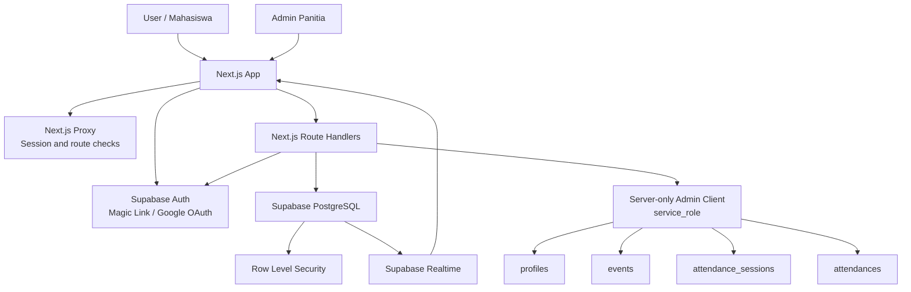
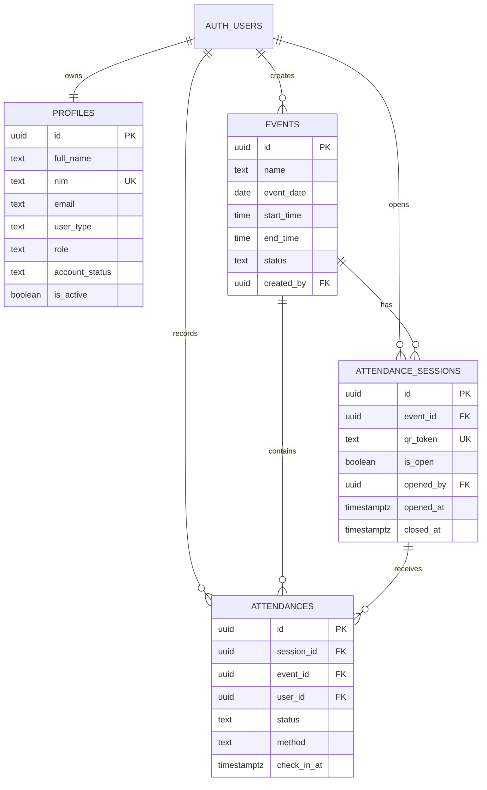
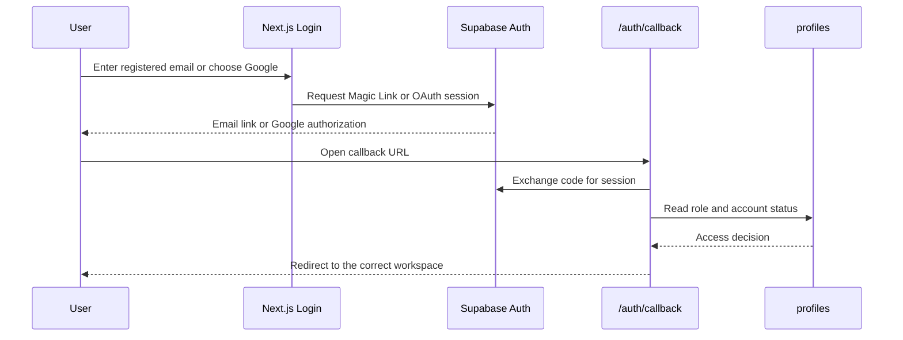
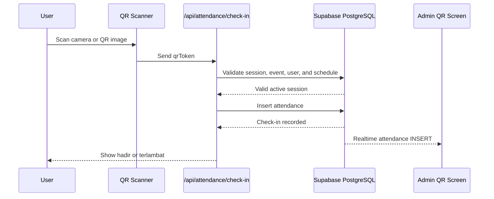

&lt;div align="center"&gt; &lt;a href="./" target="_blank"&gt; &lt;picture&gt; &lt;img alt="Absendulu Logo" src="public/logo/Absendulu.webp" width="220px" height="auto"&gt; &lt;/picture&gt; &lt;/a&gt; 

# Absendulu

 

**Digital Attendance for FILKOM UNIDA** · *Internal Organization Web App*

 

**Release:** `v0.1.1` · **Capacity:** ±50 internal users

 

> Absendulu is an internal event attendance platform for FILKOM UNIDA. Admins manage members and events, open a live QR attendance session, and monitor check-ins while users access only their own profile and attendance history.

 

[Getting Started](https://claude.ai/chat/39af80db-a584-4ac2-b693-cdef08d40c46#local-development) · [Business Flow](https://claude.ai/chat/39af80db-a584-4ac2-b693-cdef08d40c46#business-flow) · [Security](https://claude.ai/chat/39af80db-a584-4ac2-b693-cdef08d40c46#security) · [Release](https://claude.ai/chat/39af80db-a584-4ac2-b693-cdef08d40c46#release)

 &lt;/div&gt; 

Absendulu helps organization committees replace manual attendance sheets with a controlled workflow built around Supabase Auth, invite-only member provisioning, event management, QR check-in, realtime attendance counters, and role-based access control.

 

The frontend and server routes run on **Next.js 16 + React 19**, while **Supabase** provides authentication, PostgreSQL, Row Level Security, and Realtime updates.

 

---

 

## Highlights

 

- **Invite-only access** so users cannot freely create organization accounts from the login page
- **Passwordless authentication** through Supabase Magic Link and optional Google OAuth
- **Admin member management** through manual registration or CSV import of up to 500 users
- **Role-based workspace** for admins and active non-admin users
- **Event management** with date, time, location, description, and lifecycle status
- **Cryptographically random QR sessions** for event check-in
- **One check-in per user per event** enforced by both application logic and database protection
- **Realtime attendance counter** for admins while a QR session is open
- **Personal attendance history** for regular users and event-based recap for admins
- **Server-side service role isolation** so the privileged Supabase key never reaches the browser
- **Production security hardening** with RLS, CSRF origin checks, security headers, input validation, and upload limits
- **Manual production release flow** with GitHub Actions, Vercel, and protected Supabase migrations

 

---

 

## Tech Stack

 


| Layer          | Stack                                                          |
| -------------- | -------------------------------------------------------------- |
| Frontend       | Next.js 16, React 19, TypeScript, Tailwind CSS                 |
| Authentication | Supabase Auth, Magic Link, Google OAuth                        |
| Database       | Supabase PostgreSQL                                            |
| Authorization  | Application role checks, account status checks, PostgreSQL RLS |
| Realtime       | Supabase Realtime for attendance updates                       |
| QR             | `qrcode`, `html5-qrcode`                                       |
| Deployment     | Vercel + Supabase                                              |
| CI/CD          | GitHub Actions                                                 |
| Runtime        | Node.js 22+                                                    |


 

---

 

## Architecture

 

See [`docs/ci-cd.md`](http://ci-cd.md) for the deployment and migration release process.

 

### High-level architecture

 



 

### Database relationships

 



 

---

 

## Business Flow

 

### 1. Admin registers members

 

The committee creates organization accounts through the admin member-management screen:

 

- Manual member registration.
- CSV import with a maximum of 500 rows per request.
- Supported user types: `mahasiswa`, `dosen`, and `tata_usaha`.
- Student identifiers must follow the `I.#######` format.
- Staff identifiers must use a valid NIP/NIK-style identifier.

 

The Auth account is created in Supabase Auth and the organization profile is stored in `public.profiles`.

 

```text
Admin enters member data
        ↓
Validate name, email, identifier, and user type
        ↓
Create or find Supabase Auth user
        ↓
Create/update public.profiles
        ↓
Set account_status = active
        ↓
Member can use the application

```

 

### 2. User logs in

 

A user can select:

 

- **Google OAuth**, or
- **Email Magic Link**.

 

The login flow does not allow public signup:

 

```ts
shouldCreateUser: false

```

 



 

### 3. Account status determines access

 


| Status                            | Meaning                          | Destination                    |
| --------------------------------- | -------------------------------- | ------------------------------ |
| `active`                          | Account is approved and enabled  | Dashboard or student workspace |
| `invited` + incomplete profile    | User must complete identity data | `/complete-profile`            |
| `invited` + complete profile      | Waiting for committee approval   | `/waiting-approval`            |
| `disabled` or `is_active = false` | Account access is blocked        | `/account-disabled`            |


 

### 4. Admin creates an event

 

An admin enters:

 

- Event name.
- Description.
- Date.
- Start time.
- Optional end time.
- Location.

 

The server validates all fields before inserting the event. Event statuses are:

 

```text
draft → active → completed
                 ↘ cancelled

```

 

Only an `active` event can open a QR attendance session.

 

### 5. Admin opens a QR session

 

```text
Admin opens an active event
        ↓
Check that no QR session is currently open
        ↓
Generate a cryptographically random QR token
        ↓
Create attendance_sessions row
        ↓
Render QR on the admin screen

```

 

Only one open QR session is allowed per event. The database protects this rule with a unique partial index.

 

### 6. User checks in

 



 

The check-in route verifies:

 

- User has a valid authenticated session.
- User profile is active.
- QR token exists and belongs to an open session.
- Event is active.
- Current Jakarta time is inside the event schedule.
- User has not already checked in to the event.

 

Attendance status is calculated as:

 

- `hadir`: check-in is within the first 15 minutes.
- `terlambat`: check-in is more than 15 minutes after the event starts.

 

### 7. Admin closes the session

 

When the committee closes the QR session:

 

```text
is_open = false
closed_at = current timestamp

```

 

The QR token can no longer be used for new check-ins. Existing attendance records remain available in the history and admin recap.

 

### 8. Users and admins view history

 

Regular users can see only their own attendance history.

 

Admins can see a recap grouped by event, including:

 

- Participant name.
- NIM/NIP.
- Attendance status.
- Check-in method.
- Check-in time.

 

---

 

## Roles and Permissions

 

### Admin roles

 

The application recognizes these roles as administrators:

 

```text
admin
admin_bem

```

 

Admins can:

 

- View the operational dashboard.
- Manage members.
- Import CSV data.
- Create and delete events.
- Open and close QR sessions.
- View all attendance records.
- Monitor live check-in counts.

 

### Regular users

 

Active non-admin users can:

 

- View active events.
- View event details.
- Scan QR codes.
- Check in once per event.
- Edit their own permitted profile fields.
- View their own attendance history.

 

They cannot:

 

- Manage members.
- Create or delete events.
- Access QR session internals.
- View other users' attendance.
- Change their own role or account status.

 

---

 

## Project Structure

 

```text
absen/
├── app/
│   ├── (auth)/                 # Login page and auth layout
│   ├── (dashboard)/            # Protected admin and user workspaces
│   ├── api/                    # Server-side route handlers
│   │   ├── attendance/         # QR check-in
│   │   ├── events/              # Event and QR session operations
│   │   ├── members/             # Manual and CSV member management
│   │   ├── profile/             # Authenticated profile updates
│   │   └── health/              # Supabase-backed health check
│   └── auth/callback/           # Magic Link and OAuth callback
├── components/                 # Reusable UI and feature components
├── lib/
│   ├── auth/                   # Roles, identity validation, access rules
│   ├── http/                   # Request security helpers
│   └── supabase/                # Browser, server, request, and admin clients
├── public/logo/                # Absendulu branding assets
├── scripts/                    # Small regression test scripts
├── supabase/migrations/        # Ordered production database migrations
├── docs/                       # CI/CD and migration documentation
├── proxy.ts                    # Next.js 16 route/session proxy
├── next.config.ts              # Security headers and Next.js config
└── package.json                # Scripts and dependencies

```

 

---

 

## API Reference

 

### Authentication and profile

 


| Method  | Endpoint         | Description                                     |
| ------- | ---------------- | ----------------------------------------------- |
| `GET`   | `/auth/callback` | Exchange Magic Link or OAuth code for a session |
| `PATCH` | `/api/profile`   | Update permitted profile fields                 |


 

### Attendance

 


| Method | Endpoint                         | Description                                            |
| ------ | -------------------------------- | ------------------------------------------------------ |
| `POST` | `/api/attendance/check-in`       | Validate QR and create an attendance record            |
| `GET`  | `/api/events/[id]/session`       | Read the current admin QR session and attendance recap |
| `POST` | `/api/events/[id]/session/open`  | Open one QR session for an active event                |
| `POST` | `/api/events/[id]/session/close` | Close the open QR session                              |


 

### Events

 


| Method   | Endpoint           | Description                                         |
| -------- | ------------------ | --------------------------------------------------- |
| `GET`    | `/api/events`      | List events for admin operations                    |
| `POST`   | `/api/events`      | Create an event as an admin                         |
| `GET`    | `/api/events/[id]` | Read an event as an admin                           |
| `DELETE` | `/api/events/[id]` | Permanently delete an event and its attendance data |


 

### Members and operations

 


| Method | Endpoint              | Description                                    |
| ------ | --------------------- | ---------------------------------------------- |
| `POST` | `/api/members/manual` | Create or update one member as an admin        |
| `POST` | `/api/members/import` | Import up to 500 members from CSV              |
| `GET`  | `/api/health`         | Verify that the application can reach Supabase |


 

All state-changing application routes require an authenticated session, appropriate role authorization, same-origin request validation, and backend input validation.

 

---

 

## Security

 

Absendulu is designed for an internal organization deployment with approximately 50 users.

 

### Authentication

 

- Supabase Magic Link and optional Google OAuth.
- `shouldCreateUser: false` prevents unrestricted account creation from the login form.
- Auth callback validates and exchanges the authorization code server-side.
- Account status and active flags are checked before protected access is granted.
- Login errors use generic messaging to reduce email enumeration.

 

### Authorization and data protection

 

- `proxy.ts` performs an early session and route access check.
- Server routes call `getUser()` or `getUserRole()` before privileged operations.
- Admin operations use the server-only Supabase admin client.
- PostgreSQL RLS protects `profiles`, `events`, `attendance_sessions`, and `attendances`.
- Regular users can read only their own profile and attendance records.
- QR tokens and session internals are not publicly exposed.

 

### Request and application hardening

 

- All cookie-authenticated mutations require a matching `Origin` or `Referer`.
- Security headers include `X-Frame-Options`, `X-Content-Type-Options`, `Referrer-Policy`, `Permissions-Policy`, `Cross-Origin-Resource-Policy`, and production HSTS.
- CSV uploads are limited to 2 MB and 500 rows.
- User input is validated again on the server.
- Duplicate check-ins are blocked in application code and at the database level.
- `SUPABASE_SERVICE_ROLE_KEY` is never used in client code or browser bundles.

 

### CAPTCHA decision

 

Cloudflare Turnstile is not required for the current internal deployment by default because:

 

- Login is passwordless.
- Account creation is invite-only.
- Supabase Auth already rate-limits Magic Link and OTP requests.
- The application is intended for a small, known user group.

 

Turnstile can be enabled later if the app becomes public or receives bot traffic, email abuse, or repeated automated login attempts. Supabase supports Cloudflare Turnstile and hCaptcha through its Auth bot protection settings.

 

---

 

## Prerequisites

 


| Tool             | Version                                 |
| ---------------- | --------------------------------------- |
| Node.js          | 22+                                     |
| npm              | 10+ recommended                         |
| Git              | Recent version                          |
| Supabase project | Hosted project with Auth and PostgreSQL |
| Vercel           | Required only for production deployment |


 

The Supabase CLI is optional for local development but required by the documented migration workflow.

 

---

 

## Environment Variables

 

Create `.env.local` in the project root. This file must not be committed.

 


| Variable                        | Required      | Purpose                                                        |
| ------------------------------- | ------------- | -------------------------------------------------------------- |
| `NEXT_PUBLIC_SUPABASE_URL`      | Yes           | Supabase project URL; safe to expose to the browser            |
| `NEXT_PUBLIC_SUPABASE_ANON_KEY` | Yes           | Publishable/legacy anon key used by browser and server clients |
| `SUPABASE_SERVICE_ROLE_KEY`     | Yes on server | Privileged server-only key used by admin route handlers        |


 

Example:

 

```env
NEXT_PUBLIC_SUPABASE_URL=https://<project-ref>.supabase.co
NEXT_PUBLIC_SUPABASE_ANON_KEY=<publishable-or-anon-key>
SUPABASE_SERVICE_ROLE_KEY=<server-only-service-role-key>

```

 

> Never expose `SUPABASE_SERVICE_ROLE_KEY` through `NEXT_PUBLIC_*`, client components, GitHub logs, Vercel client-side code, or committed files.

 

---

 

## Supabase Setup

 

1. Create or select the Supabase project.
2. Configure Email/Magic Link under **Authentication → Providers**.
3. Enable Google OAuth only if the organization needs it.
4. Set the production Site URL and callback URL in **Authentication → URL Configuration**:
  ```text
  https://<production-domain>/auth/callback
  
  ```
5. Add the same callback URL to the Google OAuth client when Google login is enabled.
6. Apply the ordered migrations in `supabase/migrations/`:
  ```bash
  supabase db push
  
  ```
7. Confirm RLS is enabled for:
  ```text
  profiles
  events
  attendance_sessions
  attendances
  
  ```
8. Create the first admin profile by a controlled database/admin procedure. Do not allow users to self-promote through profile fields.
9. Configure Auth rate limits and monitor Auth logs.
10. Use custom SMTP for production Magic Link delivery when reliable organizational email delivery is required.

 

---

 

## Local Development

 

### 1. Clone and install

 

```bash
git clone <your-repository-url>.git
cd absen
npm ci

```

 

### 2. Configure environment

 

Create `.env.local` manually using the variables above:

 

### 3. Run the development server

 

```bash
npm run dev

```

 

Open [http://localhost:3000](http://localhost:3000).

 

### 4. Run a production-like server

 

```bash
npm run build
npm run start

```

 

---

 

## Developer Workflow

 

### Application checks

 

```bash
npm run test:schedule
npm run lint
npm run typecheck
npm run build

```

 

Or run the complete gate:

 

```bash
npm run check

```

 

### Database changes

 

- Add ordered SQL migrations under `supabase/migrations/`.
- Review RLS, grants, indexes, triggers, and existing data impact.
- Inspect remote migration history before applying production changes.
- Apply migrations through the protected GitHub Actions workflow when using the production release process.

 

### CI/CD flow

 

```text
Feature branch
      ↓
Pull request into develop
      ↓
GitHub Actions: npm ci + npm run check
      ↓
Review and merge
      ↓
Manual migration workflow (if schema changed)
      ↓
Protected production approval
      ↓
Manual deploy workflow
      ↓
Vercel production + smoke tests

```

 

See [`docs/ci-cd.md`](http://ci-cd.md) for required GitHub secrets, Vercel configuration, protected environments, and migration commands.

 

---

 

## Deployment

 

### Vercel

 

Set these variables in the Vercel **Production** environment:

 

```text
NEXT_PUBLIC_SUPABASE_URL
NEXT_PUBLIC_SUPABASE_ANON_KEY
SUPABASE_SERVICE_ROLE_KEY

```

 

Deploy only after:

 

```bash
npm run check

```

 

The production workflow validates:

 

- Production build.
- Security headers.
- Protected route redirects.
- Anonymous mutation rejection.
- Supabase-backed health endpoint.

 

### Supabase migrations

 

Production migrations are applied by the manually approved GitHub Actions workflow:

 

```text
Actions → Apply Supabase migrations → type APPLY

```

 

The workflow inspects migration history, runs a dry-run, applies migrations to the protected production database, and keeps the database URL in the protected `production` environment.

 

### Production smoke checks

 

After deployment, verify:

 

- `/login` loads.
- Unauthenticated access to `/dashboard` redirects to `/login`.
- `/api/health` returns `{"status":"ok"}`.
- Anonymous profile mutation returns `401`.
- Anonymous attendance check-in returns `401`.
- Security headers are present.
- Magic Link and Google callback redirect to the correct workspace.
- Admin can create an event and open one QR session.
- An active user can check in once and see the attendance history.

 

---

 

## Validation Status

 

The `v0.1.1` release passed:

 

```text
npm run test:schedule  PASS
npm run lint           PASS
npm run typecheck      PASS
npm run build          PASS
npm run check          PASS
npm audit              0 vulnerabilities

```

 

---

 

## Release

 

Current release:

 

```text
v0.1.1

```

 

Release commit:

 

```text
54813bb docs: add comprehensive project README

```

 

Create a new annotated release tag:

 

```bash
git tag -a v0.2.0 -m "Release v0.2.0"
git push origin develop
git push origin v0.2.0

```

 

The `v0.1.0` tag is the previous remote release. The current `v0.1.1` tag points to the latest pushed commit.

 

---

 

## Troubleshooting

 


| Problem                                   | What to check                                                                                                   |
| ----------------------------------------- | --------------------------------------------------------------------------------------------------------------- |
| Magic Link is not received                | Check Supabase Auth email provider, SMTP, spam folder, Site URL, and rate limits                                |
| OAuth callback fails                      | Verify the Supabase redirect URL and Google OAuth callback configuration                                        |
| User is redirected to `/complete-profile` | Check `profiles.full_name`, `profiles.nim`, `user_type`, and `account_status`                                   |
| User is redirected to `/account-disabled` | Check `profiles.account_status` and `is_active`                                                                 |
| Admin page redirects to student workspace | Check that the profile role is exactly `admin` or `admin_bem` and account is active                             |
| Check-in is rejected                      | Confirm event status, QR session status, event schedule, account status, and duplicate history                  |
| Realtime counter does not update          | Confirm `attendances` is enabled in Supabase Realtime publication and the session ID is correct                 |
| `/api/health` returns `degraded`          | Check `NEXT_PUBLIC_SUPABASE_URL` and server-side `SUPABASE_SERVICE_ROLE_KEY`                                    |
| CSV import fails                          | Check file size, CSV headers, identifier format, duplicate emails, duplicate identifiers, and the 500-row limit |
| Production deploy fails                   | Run `npm run check`, verify Vercel environment variables, and inspect the protected workflow logs               |


 

---

 

## License

 

This project is an internal attendance application for organization operations. Define the repository license and ownership policy before making the project public.