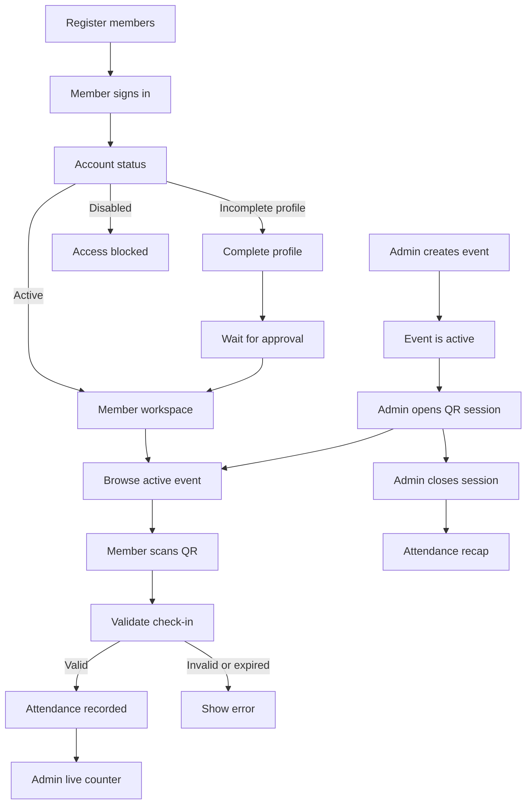

# Absendulu Business User Guide

This guide explains how FILKOM UNIDA committees and members use Absendulu in daily operations. It is written for administrators, event committees, members, and technical operators.

Absendulu is an internal attendance application. It is not an open registration system: members must be provisioned by an administrator before they can use the application.

## 1. Business Roles

### Administrator / Committee

An administrator manages the organization workspace and attendance operations. Admin roles are:

- `admin`
- `admin_bem`

Administrators are responsible for:

- Registering members before an event.
- Checking member identity data.
- Creating and publishing events.
- Opening the QR attendance session at the venue.
- Monitoring live check-ins.
- Closing the attendance session.
- Reviewing attendance recaps.
- Disabling accounts when access should be revoked.

### Member / Attendee

A regular active member can:

- Sign in with a registered email or Google account.
- Complete required identity information when requested.
- Browse active events.
- Scan an event QR code.
- Check in once per event.
- View their own attendance history.

A regular member cannot manage other accounts, create events, view QR session internals, or view other members' attendance records.

### Technical Operator

The technical operator maintains the deployment and database configuration. This role should be separate from routine event operations where possible.

The technical operator is responsible for:

- Keeping production environment variables configured.
- Applying reviewed database migrations.
- Monitoring `/api/health` and deployment logs.
- Maintaining Supabase Auth providers and redirect URLs.
- Maintaining backups and access to the production project.

## 2. End-to-End Business Process



The normal operating sequence is:

1. The committee registers members.
2. Members sign in and complete their profile if needed.
3. An administrator creates an active event.
4. The administrator opens the QR session at the event location.
5. Members scan the QR code during the allowed event schedule.
6. Absendulu records each successful check-in and updates the admin counter.
7. The administrator closes the QR session.
8. The committee reviews the event attendance recap.

## 3. Before an Event

### Administrator checklist

Before an event, the administrator should:

- Confirm all expected members have been imported or registered.
- Confirm names, email addresses, and NIM/NIP values.
- Confirm each attendee has the correct user type.
- Confirm disabled accounts are intentionally disabled.
- Create the event with the correct date, start time, end time, and location.
- Confirm the event status is `active` before the event begins.
- Prepare a screen or device that can display the QR code at the venue.
- Confirm the venue has a reliable internet connection for check-in.

### Member checklist

Members should:

- Use the email address registered by the committee.
- Open the Magic Link on the same device or browser where possible.
- Complete their profile using the correct identity number.
- Allow camera access when using the QR scanner.
- Keep the QR code fully visible when scanning.

## 4. Registering Members

There are two supported registration methods.

### Manual registration

Use manual registration for a single member or a small number of corrections.

1. Sign in as an administrator.
2. Open **Members**.
3. Choose the manual member form.
4. Enter the member's full name, email, identifier, user type, division, and phone when available.
5. Submit the form.
6. Confirm the member appears in the member list.
7. Tell the member to use the registered email to sign in.

### CSV import

Use CSV import for a larger member list.

The import rules are:

- Maximum 500 members per import.
- Maximum CSV file size: 2 MB.
- Required business fields: `full_name`, `nim`, `email`, and `user_type`.
- Accepted user types: `mahasiswa`, `dosen`, and `tata_usaha`.
- Student NIM format: `I.#######`, for example `I.2410036`.
- Duplicate email addresses in the same file are rejected.
- Duplicate NIM/NIP identifiers in the same file are rejected.

Recommended CSV headers:

```csv
full_name,nim,email,user_type,division,phone
Alya Putri,I.2410036,alya@example.com,mahasiswa,PSDM,081234567890
Budi Santoso,198801012020011001,budi@example.com,dosen,Akademik,081234567891
```

Import procedure:

1. Prepare the CSV using the approved headers.
2. Check that emails and identifiers are unique.
3. Sign in as an administrator.
4. Open **Members** and select CSV import.
5. Upload the file.
6. Review the result groups: imported, existing, and failed.
7. Correct failed rows and import them again if necessary.
8. Do not repeatedly import a file without reviewing the result, because existing profiles may be updated.

### Account provisioning behavior

Admin-created users are provisioned as active members. If a user is created through another Auth path, the database trigger creates a safe invited profile instead of granting immediate operational access. This prevents an unregistered person from becoming an active organization member solely by creating an Auth identity.

## 5. Member Login and Approval

### Magic Link login

1. Open the application login page.
2. Enter the email registered by the committee.
3. Select **Kirim Link**.
4. Open the email from Supabase Auth.
5. Select the login link.
6. Return to the application.

Magic Links are one-time links and are subject to Supabase Auth expiration and rate limits. If a new link is requested too quickly, wait and request again later.

### Google OAuth login

1. Select **Masuk dengan Google**.
2. Choose the Google account that the committee registered.
3. Approve the OAuth request if prompted.
4. Return to the application callback.

The Google account email must match the provisioned organization account. Using a different Google account can result in an unrecognized or inactive profile.

### Account status screens

| Screen | Meaning | Required action |
|---|---|---|
| `/complete-profile` | Required identity data is missing or invalid | Enter the correct full name and NIM/NIP |
| `/waiting-approval` | The profile is complete but requires committee review | Wait for an administrator to activate the account |
| `/account-disabled` | The account is disabled or inactive | Contact the committee or technical operator |
| Workspace | The account is active | Use the application normally |

The account status is controlled by the organization. Members must not try to change role, account status, or active flags from the client.

## 6. Creating an Event

1. Sign in as an administrator.
2. Open **Events**.
3. Select **Buat acara**.
4. Enter the event name.
5. Add a short description and location.
6. Set the event date and start time.
7. Set an end time when the attendance window should have a fixed end.
8. Submit the form.
9. Open the event detail page and confirm the schedule.

Business rules:

- The name is required.
- The date must be a real calendar date.
- Start and end times must be valid.
- The end time must follow the supported schedule rules.
- Only active events can open a QR session.
- Event deletion is permanent for the event's attendance and session data. Use it only when the committee has confirmed the deletion.

## 7. Opening and Displaying the QR Code

At the event venue:

1. Open the event detail page as an administrator.
2. Confirm that the event status is `active`.
3. Select **Buka absensi** or the QR action.
4. Open the QR display page.
5. Display the QR code on a projector, monitor, or administrator device.
6. Keep the QR display visible during the approved attendance period.

Only one QR session can be open for an event at a time. If multiple administrators click the open action at the same time, the database constraint keeps one active session and the other request reuses the existing session.

Do not copy or publish the raw QR token. The token is an operational credential for the open attendance session.

## 8. Checking In

### Camera scan

1. Sign in as an active member.
2. Open **Scan**.
3. Select **Aktifkan kamera**.
4. Allow camera access.
5. Point the camera at the complete QR code.
6. Wait for the confirmation message.

### Image scan

If the camera is unavailable:

1. Open **Scan**.
2. Select **Pilih gambar QR**.
3. Choose a clear image containing the complete QR code.
4. Wait for the validation result.

### Check-in rules

A check-in is accepted only when:

- The user session is valid.
- The profile is active.
- The QR session is open.
- The event is active.
- The current time is inside the event schedule.
- The user has not already checked in to the event.

The status is:

- `hadir` when the check-in is within the first 15 minutes after the start time.
- `terlambat` when the check-in is later than the first 15 minutes but before the end of the attendance window.

A second check-in for the same event is rejected. This is intentional and protects the attendance record from duplicate scans or repeated requests.

## 9. Monitoring and Closing Attendance

While the QR session is open, an administrator can:

- See the live check-in count.
- Review recent participants.
- Confirm that attendance records are arriving.
- Ask a member to retry if the scanner or network fails.

To close attendance:

1. Confirm the announced attendance window has ended.
2. Open the active QR session page.
3. Select **Tutup sesi absensi**.
4. Confirm that the session is no longer open.
5. Keep the event and attendance recap for organizational reporting.

After closing, the QR code must not be reused. A new attendance window should use a newly opened session according to the committee's event policy.

## 10. Reviewing Attendance History

### Member view

Members can open **Attendance History** to see their own records, including:

- Event name.
- Check-in time.
- Check-in method.
- Attendance status.
- Optional notes when available.

### Admin view

Administrators can open **Attendance History** to review the operational recap grouped by event. The recap includes:

- Participant name.
- NIM/NIP.
- Attendance status.
- Method, normally `QR_CODE`.
- Check-in timestamp.

Use the admin recap for internal reports, follow-up, and event evaluation. Do not share the full recap outside authorized organization channels because it contains member identity and attendance information.

## 11. Common Business Scenarios

### A registered member cannot log in

1. Confirm the member is using the registered email.
2. Check the spelling and case of the email address.
3. Ask the member to wait for the Auth rate limit window if several links were requested.
4. Check whether the account exists in Supabase Auth.
5. Check the matching `profiles.email` and `account_status`.
6. Check whether the account is disabled.

### A member can log in but is sent to profile completion

Check:

- `profiles.full_name`.
- `profiles.nim`.
- `profiles.user_type`.
- Student NIM format `I.#######`.
- Staff identifier format.

The member should submit only their own permitted profile fields. Role and activation fields remain administrator-controlled.

### A valid member cannot scan the QR code

Check:

- Camera permission or image quality.
- QR display brightness and framing.
- Event status is `active`.
- QR session is still open.
- Current time is within the event schedule.
- The member has not already checked in.
- The device has internet access.

### A member is marked late

This is expected when the check-in occurs more than 15 minutes after the configured start time. The application evaluates the schedule using the `Asia/Jakarta` timezone.

### The admin counter does not update

1. Confirm the check-in request succeeded for the member.
2. Refresh the QR page once if the network connection changed.
3. Confirm the `attendances` table is enabled for Supabase Realtime.
4. Confirm the QR page is using the current session ID.
5. Use the attendance history as the source of truth if the live counter display is temporarily stale.

### A wrong member was imported

Do not delete database rows manually. An administrator should:

1. Stop using the affected account for new attendance.
2. Review whether the profile has existing attendance history.
3. Correct the member profile through the approved admin flow.
4. If attendance data must be corrected, follow the organization's data correction procedure and record the reason.

## 12. Data and Privacy Rules

Absendulu stores identity and attendance information. Organization operators should:

- Give access only to authorized administrators.
- Avoid exporting full attendance data to personal devices.
- Avoid sharing QR tokens publicly.
- Use production Supabase and Vercel access controls.
- Keep `SUPABASE_SERVICE_ROLE_KEY` out of GitHub, browser code, screenshots, and chat messages.
- Review disabled accounts promptly.
- Retain attendance records according to the organization's policy.
- Use backups and migration history when making database changes.

## 13. Technical Release and Database Operations

The application source is primarily TypeScript, but the database schema and security rules are expressed in PostgreSQL SQL and PL/pgSQL. This is normal for a Supabase application.

### Should SQL be committed to GitHub?

Yes. The following SQL should be committed:

- Versioned migrations in `supabase/migrations/`.
- Reviewed schema definitions or baseline SQL such as `docs/schema.sql` when it is maintained as documentation.
- Database functions, triggers, indexes, grants, and RLS policies that are part of the application.

SQL in the repository provides:

- Reproducible database setup.
- Reviewable security policy changes.
- Migration history.
- Recovery and onboarding documentation.
- A clear relationship between application code and database behavior.

Never commit:

- `.env.local`.
- `SUPABASE_SERVICE_ROLE_KEY`.
- Database passwords or connection strings containing passwords.
- Supabase access tokens.
- Personal access tokens.
- Production data dumps containing member information.
- Unredacted logs containing email addresses, tokens, or personal data.

The normal change flow is:

```text
Edit application or SQL migration
        ↓
Review TypeScript, SQL, RLS, grants, and data impact
        ↓
Run npm run check
        ↓
Inspect remote migration history
        ↓
Preview pending migrations
        ↓
Apply migration through the protected workflow
        ↓
Deploy the compatible application commit
        ↓
Run production smoke checks
```

`PLpgSQL` is not a problem for a TypeScript application. TypeScript owns the web application and request flow; PostgreSQL SQL/PLpgSQL owns database constraints, triggers, RLS policies, and transactional data rules. Both belong in source control, but secrets and real user data do not.

## 14. Quick Operating Checklist

### Before each event

- [ ] Members are registered and verified.
- [ ] Event date, time, location, and status are correct.
- [ ] The event is active.
- [ ] The QR display device and network are ready.

### During attendance

- [ ] The QR code is visible and not shared outside the venue policy.
- [ ] The admin monitors the live count.
- [ ] Members use their own registered accounts.
- [ ] Failed scans are checked against schedule and account status.

### After attendance

- [ ] The QR session is closed.
- [ ] The attendance recap is reviewed.
- [ ] Exceptions are documented.
- [ ] The recap is shared only with authorized recipients.
- [ ] The event remains available for future reporting.

### Before a production database change

- [ ] The migration has a descriptive filename.
- [ ] RLS, grants, functions, triggers, and existing rows were reviewed.
- [ ] Remote migration history was inspected.
- [ ] A backup or recovery path is available.
- [ ] The migration workflow is run with protected approval.
- [ ] Production smoke checks pass.
